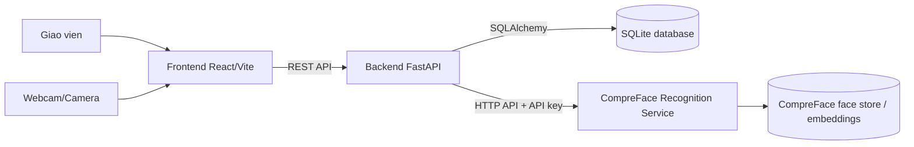
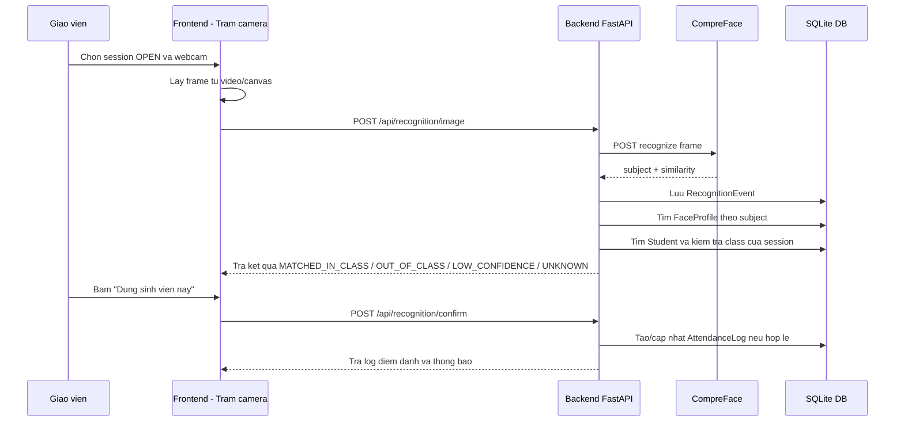

# Face Attendance MVP

He thong diem danh sinh vien bang nhan dien khuon mat, gom:

- Frontend Web: React/Vite
- Backend API: FastAPI
- Database: SQLite qua SQLAlchemy ORM
- AI Face Recognition: CompreFace Docker API
- Tai lieu thiet ke: ERD, DFD, FDD, kien truc tong the trong `kientruc/`

README nay duoc tong hop tu source code hien tai va knowledge graph sinh trong `.understand-anything/`. Graph phan tich duoc 66 file, 266 node, 315 edge va cac layer chinh: Backend API, Backend Domain/Data, Frontend Web, Ops/Integration Scripts, Architecture Documentation va Domain Concepts.

## Muc tieu nghiep vu

He thong ho tro giao vien diem danh bang camera:

1. Import danh sach sinh vien bang CSV.
2. Map sinh vien trong database voi subject tren CompreFace.
3. Tao va mo buoi diem danh cho lop/mon hoc.
4. Giao vien chon session dang `OPEN`, chon webcam, bat camera va bat dau quet.
5. Backend gui frame camera sang CompreFace de nhan dien.
6. Backend lay subject CompreFace, tim `FACE_PROFILE`, tim `STUDENT`, kiem tra sinh vien co thuoc lop cua session khong.
7. Frontend hien thi thong tin sinh vien va trang thai:
   - Thuoc lop
   - Khong thuoc lop nay
   - Subject chua map
   - Can kiem tra lai do similarity thap
   - Khong nhan dien duoc
8. Giao vien bam "Dung sinh vien nay" thi backend moi ghi diem danh chinh thuc.
9. Neu bam "Khong phai sinh vien trong lop" hoac "Bo qua" thi khong tao attendance log chinh thuc.

## Kien truc he thong



### Cac layer trong source

| Layer | Thu muc/file chinh | Vai tro |
|---|---|---|
| Frontend Web | `frontend/src/App.jsx`, `frontend/src/App.css` | UI quan ly sinh vien, lop, mon, ho so khuon mat, buoi diem danh va tram camera |
| Backend API | `backend/app/main.py`, `backend/app/routers/` | REST API cho frontend; khong de frontend goi truc tiep CompreFace |
| Backend Domain/Data | `backend/app/services.py`, `backend/app/models.py`, `backend/app/database.py`, `backend/app/serializers.py` | Xu ly nghiep vu, ORM model, DB session, serialize response |
| CompreFace integration | `backend/app/compreface_client.py`, `CompreFace_BachKhoa/docker-compose.yml` | Goi API CompreFace, list subject, create subject, upload face, recognize image |
| Test/utility scripts | `scripts/` | Smoke test CompreFace va danh gia dataset |
| Tai lieu thiet ke | `kientruc/` | ERD, DFD, FDD, kien truc tong the, Mermaid diagrams |
| Legacy desktop app | `main_app.py`, `client_app.py`, `attendance_service.py`, `database/` | Phien ban desktop/thu nghiem cu, giu lai de tham khao |

## Data pipeline diem danh camera



### Diem quan trong trong nghiep vu

- Recognition khong tu dong ghi diem danh.
- Attendance log chi duoc ghi khi session dang `OPEN`.
- Attendance log chi duoc ghi neu sinh vien thuoc lop cua session.
- Mot sinh vien chi co mot attendance log chinh thuc trong mot session.
- Subject CompreFace duoc map qua bang `face_profiles`; khong map truc tiep o frontend.
- API key CompreFace chi nam o backend/env, khong dua vao frontend.

## Database schema chinh

ORM model nam trong `backend/app/models.py`.

| Bang | Vai tro |
|---|---|
| `study_classes` | Lop hoc/hoc phan theo lop |
| `students_mvp` | Sinh vien, ma sinh vien, lop, khoa, nganh |
| `courses` | Mon hoc |
| `class_courses` | Gan lop voi mon hoc/ky hoc |
| `attendance_sessions_mvp` | Buoi diem danh |
| `face_profiles` | Map `student_id` voi `compreface_subject` |
| `cameras` | Camera/tram diem danh |
| `recognition_events` | Su kien nhan dien tu camera |
| `attendance_logs_mvp` | Log diem danh chinh thuc |

Rang buoc quan trong:

- `face_profiles.student_id` unique
- `face_profiles.compreface_subject` unique
- `attendance_logs_mvp.session_id + student_id` unique
- `attendance_logs_mvp.recognition_event_id` unique neu log duoc tao tu event nhan dien

## Cau truc thu muc nen doc

```text
.
|-- backend/
|   |-- app/
|   |   |-- main.py
|   |   |-- models.py
|   |   |-- services.py
|   |   |-- compreface_client.py
|   |   |-- database.py
|   |   |-- serializers.py
|   |   `-- routers/
|   `-- README.md
|-- frontend/
|   |-- src/
|   |   |-- App.jsx
|   |   |-- App.css
|   |   `-- main.jsx
|   |-- package.json
|   `-- vite.config.js
|-- scripts/
|   |-- compreface_smoke_test.py
|   `-- compreface_dataset_eval.py
|-- kientruc/
|   |-- 01_kien_truc_he_thong.md
|   |-- 02_mo_hinh_er.md
|   |-- 03_bieu_do_fdd.md
|   |-- 04_bieu_do_dfd.md
|   `-- diagrams/
|-- CompreFace_BachKhoa/
|   `-- docker-compose.yml
|-- .env.example
|-- requirements.txt
`-- README.md
```

## Chuan bi moi truong

### 1. Clone repo

```bash
git clone https://github.com/lovemom-exe/Face-Recognition-with-Real-time-Database-use-compreface.git
cd Face-Recognition-with-Real-time-Database-use-compreface
```

### 2. Tao file cau hinh backend

Copy `.env.example` thanh `.env` va dien API key Recognition Service cua CompreFace:

```env
COMPREFACE_BASE_URL=http://localhost:8000
COMPREFACE_RECOGNITION_API_KEY=replace-with-your-recognition-service-api-key
ATTENDANCE_RECOGNITION_THRESHOLD=0.97
```

Khong commit `.env`.

### 3. Chay CompreFace

Neu dung docker compose trong repo:

```bash
cd CompreFace_BachKhoa
docker compose up -d
```

Mo CompreFace UI:

```text
http://localhost:8000
```

Trong CompreFace:

1. Tao Face Recognition Service.
2. Lay API key cua service do.
3. Dien API key vao `.env` hoac bien moi truong `COMPREFACE_RECOGNITION_API_KEY`.

### 4. Chay backend

Windows PowerShell:

```powershell
cd <repo>
python -m venv .venv
.\.venv\Scripts\pip.exe install -r requirements.txt
$env:COMPREFACE_BASE_URL="http://localhost:8000"
$env:COMPREFACE_RECOGNITION_API_KEY="your-recognition-api-key"
$env:ATTENDANCE_RECOGNITION_THRESHOLD="0.97"
.\.venv\Scripts\python.exe -m uvicorn backend.app.main:app --reload --host 127.0.0.1 --port 8080
```

Backend docs:

```text
http://127.0.0.1:8080/docs
```

Ghi chu: SQLite database `backend_attendance.db` se duoc tao local khi backend start. File DB khong duoc commit.

### 5. Chay frontend

Mo terminal moi:

```bash
cd frontend
npm install
npm run dev -- --host 127.0.0.1 --port 5173
```

Frontend:

```text
http://127.0.0.1:5173
```

Neu can doi API backend:

```bash
VITE_API_BASE_URL=http://127.0.0.1:8080 npm run dev
```

## Flow mo phong cho ban cung nhom

### Buoc 1: Import CSV sinh vien

Vao tab "Danh muc", import CSV.

Header CSV duoc ho tro:

```csv
student_code,full_name,class_code,class_name,cohort,major,email
B21DCCN001,Nguyen Van A,CNTT01,Cong nghe thong tin 01,K66,CNTT,a@example.com
```

Backend se:

- Validate ma sinh vien.
- Bao loi neu thieu ma sinh vien/ho ten/lop.
- Tu tao lop neu CSV co `class_code` moi.

### Buoc 2: Tao mon hoc va gan lop - mon

Trong tab "Buoi diem danh":

1. Tao mon hoc.
2. Gan lop voi mon hoc trong "Gan lop - mon".

### Buoc 3: Map ho so khuon mat

Trong tab "Ho so khuon mat":

1. Chon sinh vien trong database.
2. Chon subject CompreFace da enroll anh.
3. Bam "Luu ho so".

Backend se validate:

- Subject co ton tai tren CompreFace.
- Subject chua bi map voi sinh vien khac.
- Mot sinh vien chi co mot face profile active theo schema hien tai.

### Buoc 4: Tao va mo session diem danh

Trong tab "Buoi diem danh":

1. Tao session cho lop/mon.
2. Bam nut mo session.
3. Chi session `OPEN` moi hien trong "Tram camera".

### Buoc 5: Diem danh bang camera

Trong tab "Tram camera":

1. Chon session dang `OPEN`.
2. Chon webcam o "Camera dau vao".
3. Bam "Bat camera".
4. Bam "Bat dau quet" hoac "Quet 1 lan".
5. Khi co ket qua, xem card thong tin sinh vien.
6. Bam:
   - "Dung sinh vien nay": ghi diem danh neu hop le.
   - "Khong phai sinh vien trong lop": khong ghi attendance log.
   - "Bo qua": an ket qua hien tai.

## API quan trong

| Method | URL | Vai tro |
|---|---|---|
| `POST` | `/api/students/import-csv` | Import sinh vien |
| `GET` | `/api/classes/{class_id}` | Chi tiet lop kem danh sach sinh vien va face profile |
| `GET` | `/api/compreface/subjects` | Lay subject tu CompreFace |
| `POST` | `/api/students/{student_id}/face-profile` | Map student voi CompreFace subject |
| `POST` | `/api/attendance-sessions` | Tao buoi diem danh |
| `POST` | `/api/attendance-sessions/{session_id}/open` | Mo buoi diem danh |
| `POST` | `/api/attendance-sessions/{session_id}/close` | Dong buoi diem danh |
| `GET` | `/api/attendance-sessions/open` | Lay session dang OPEN |
| `POST` | `/api/recognition/image` | Nhan frame tu frontend va goi CompreFace |
| `POST` | `/api/recognition/confirm` | Giao vien xac nhan ghi diem danh |
| `POST` | `/api/recognition/{recognition_event_id}/reject` | Tu choi/bo qua ket qua nhan dien |
| `GET` | `/api/attendance-sessions/{session_id}/roster` | Danh sach sinh vien trong session kem trang thai diem danh |
| `GET` | `/api/students/{student_id}/attendance-summary` | Thong ke di hoc/nghi/muon cua sinh vien |

## Test nhanh CompreFace

Script smoke test:

```bash
python scripts/compreface_smoke_test.py --help
```

Script danh gia dataset:

```bash
python scripts/compreface_dataset_eval.py --help
```

Dataset anh that/Kaggle nen dat ngoai Git, vi folder `archive/` da duoc ignore.

## Luu y khi push Git

Khong push:

- `.env`
- `*.db`, `*.sqlite`
- `archive/`
- `.venv/`
- `frontend/node_modules/`
- `frontend/dist/`
- `CompreFace_BachKhoa/**/*.env`

Chi push source code, tai lieu thiet ke, script va file cau hinh mau.
