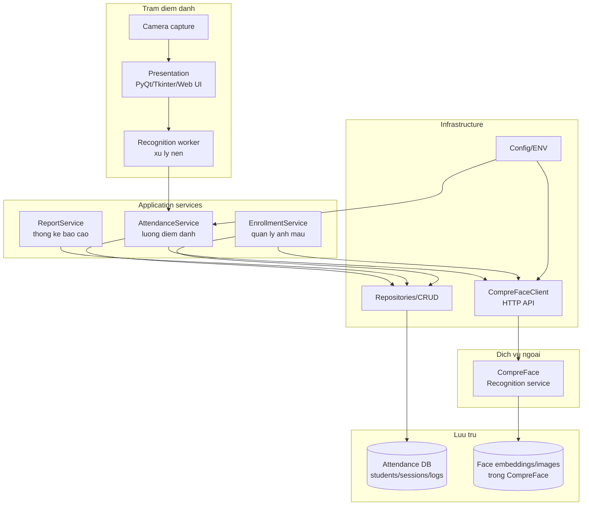
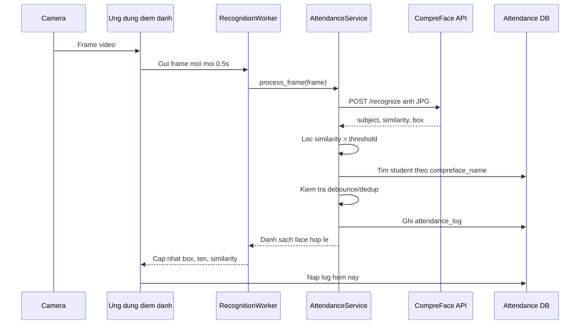

# Kien truc he thong diem danh bang nhan dien khuon mat

## 1. Muc tieu he thong

He thong ho tro diem danh tu dong trong lop hoc/phong thi bang camera. Khi sinh vien xuat hien truoc camera, ung dung chup frame, gui len dich vu nhan dien khuon mat, doi chieu ket qua voi danh sach sinh vien, sau do ghi nhan log diem danh theo buoi hoc.

## 2. Van de cua hien trang

Code hien tai da chay duoc luong co ban, nhung can thiet ke lai de thanh he thong quan ly ro rang hon:

| Van de | Hien trang | Huong xu ly |
|---|---|---|
| Tang giao dien va xu ly nghiep vu con gan nhau | `main_app.py` khoi tao UI, thread camera, worker AI va goi CRUD | Tach UI, service, repository |
| API key hardcode | API key CompreFace nam trong source | Dua vao file cau hinh hoac bien moi truong |
| Quan ly train/enroll chua duoc mo hinh hoa | CompreFace subject khop voi `students.compreface_name` | Them khai niem `FaceProfile`/ho so khuon mat trong thiet ke ER |
| Buoi hoc chua gan chat vao luong diem danh | `session_id` co trong DB nhung service chua tu dong lay active session | Service can tim buoi hoc dang dien ra theo lop |
| Chua luu su kien nhan dien loi/unknown | Chi log khi similarity > 0.97 | Them `RecognitionEvent` de phuc vu audit, tinh chinh threshold |
| Bao cao con don gian | UI moi hien log hom nay | Them thong ke theo lop, buoi hoc, thoi gian, vang/muon |

## 3. Kien truc de xuat



## 4. Luong train/enroll khuon mat

Trong kien truc nay, "train" nen hieu la qua trinh dang ky va cap nhat ho so khuon mat cho tung sinh vien:

1. Quan tri vien tao ho so sinh vien trong DB.
2. He thong sinh `compreface_name` duy nhat cho sinh vien.
3. Quan tri vien chup/tai anh mau khuon mat.
4. `EnrollmentService` goi CompreFace API de tao subject va upload anh mau.
5. CompreFace tao embedding va luu trong face store rieng.
6. DB luu quan he `student_id` - `compreface_name` - trang thai ho so khuon mat.
7. He thong kiem tra lai bang cach nhan dien thu mot anh mau va doi chieu subject tra ve.

Quy tac de xuat:

| Quy tac | Mo ta |
|---|---|
| So anh mau toi thieu | 5-10 anh/sinh vien, du goc mat va dieu kien sang |
| Ten subject | Dung ma sinh vien hoac slug duy nhat, khong dung ten trung |
| Trang thai ho so | `PENDING`, `ACTIVE`, `RETRAIN_REQUIRED`, `DISABLED` |
| Bao mat | Khong luu anh khuon mat trong DB diem danh neu khong can; DB chi luu metadata |
| Chat luong | Anh qua mo, khong co mat, co nhieu mat phai bi tu choi |

## 5. Luong diem danh thoi gian thuc



## 6. Cau truc source de xuat

Khong can di chuyen ngay code hien tai, nhung khi refactor nen dua ve cau truc sau:

```text
src/
  app/
    main.py
    config.py
  ui/
    main_window.py
    camera_view.py
    attendance_table.py
  services/
    attendance_service.py
    enrollment_service.py
    report_service.py
  infrastructure/
    compreface_client.py
    camera.py
  repositories/
    student_repository.py
    session_repository.py
    attendance_repository.py
  database/
    models.py
    db_config.py
    migrations/
tests/
  test_attendance_service.py
  test_repositories.py
```

## 7. Mapping voi code hien co

| Thiet ke de xuat | Dang nam o file hien tai |
|---|---|
| `ui/main_window.py` | `main_app.py` - class `MainWindow` |
| `infrastructure/camera.py` | `main_app.py` - class `CameraThread` |
| `services/attendance_service.py` | `attendance_service.py` |
| `infrastructure/compreface_client.py` | Logic `requests.post(...)` trong `attendance_service.py` |
| `repositories/*` | `database/crud.py` |
| `database/models.py` | `database/models.py` |
| `config.py` | Hang so `API_KEY`, `API_URL`, `DATABASE_URL` |

## 8. Quy tac nghiep vu chinh

| Ma | Quy tac |
|---|---|
| BR01 | Chi ghi diem danh neu subject tra ve khop voi sinh vien trong DB |
| BR02 | Chi chap nhan ket qua nhan dien khi similarity >= nguong cau hinh, hien tai la 0.97 |
| BR03 | Khong ghi trung neu sinh vien vua duoc ghi trong cua so dedup, hien tai 5 phut |
| BR04 | Trang thai `ON_TIME`/`LATE` duoc tinh theo gio bat dau buoi hoc va nguong tre |
| BR05 | Log diem danh phai luu thoi gian, sinh vien, buoi hoc, similarity va nguon camera |
| BR06 | Unknown face khong tao attendance log, nhung nen tao recognition event de doi soat |
