# Bieu do phan cap chuc nang FDD

## 1. FDD tong the

```mermaid
flowchart TD
    A["0. He thong quan ly diem danh bang nhan dien khuon mat"]

    A --> B["1. Quan ly danh muc"]
    B --> B1["1.1 Quan ly sinh vien"]
    B --> B2["1.2 Quan ly lop"]
    B --> B3["1.3 Quan ly mon hoc"]
    B --> B4["1.4 Quan ly buoi hoc"]

    A --> C["2. Quan ly du lieu khuon mat"]
    C --> C1["2.1 Tao subject tren CompreFace"]
    C --> C2["2.2 Thu thap anh mau"]
    C --> C3["2.3 Upload/enroll anh mau"]
    C --> C4["2.4 Kiem tra chat luong ho so"]
    C --> C5["2.5 Khoa/mo khoa ho so khuon mat"]

    A --> D["3. Diem danh thoi gian thuc"]
    D --> D1["3.1 Mo camera"]
    D --> D2["3.2 Chup frame dinh ky"]
    D --> D3["3.3 Gui frame den AI"]
    D --> D4["3.4 Nhan ket qua subject/similarity"]
    D --> D5["3.5 Hien thi bounding box"]

    A --> E["4. Xu ly va ghi nhan diem danh"]
    E --> E1["4.1 Tra cuu sinh vien"]
    E --> E2["4.2 Kiem tra nguong similarity"]
    E --> E3["4.3 Chong ghi trung"]
    E --> E4["4.4 Xac dinh dung gio/di muon"]
    E --> E5["4.5 Luu attendance log"]

    A --> F["5. Tra cuu va bao cao"]
    F --> F1["5.1 Xem danh sach diem danh hom nay"]
    F --> F2["5.2 Loc theo lop/buoi hoc"]
    F --> F3["5.3 Thong ke dung gio/di muon/vang"]
    F --> F4["5.4 Xuat bao cao"]

    A --> G["6. Quan tri he thong"]
    G --> G1["6.1 Cau hinh API/threshold"]
    G --> G2["6.2 Quan ly tai khoan"]
    G --> G3["6.3 Theo doi loi ket noi AI"]
    G --> G4["6.4 Sao luu phuc hoi du lieu"]
```

## 2. Mo ta chuc nang

| Ma | Chuc nang | Dau vao | Xu ly | Dau ra |
|---|---|---|---|---|
| 1.1 | Quan ly sinh vien | Ho ten, ma SV, lop, subject | Them/sua/xoa/tim kiem sinh vien | Danh sach sinh vien |
| 1.4 | Quan ly buoi hoc | Lop, mon, gio bat dau, nguong tre | Tao lich/buoi diem danh | Buoi hoc active |
| 2.1 | Tao subject | Thong tin sinh vien | Goi CompreFace tao subject | `compreface_name` |
| 2.3 | Upload/enroll anh mau | Anh khuon mat | Gui anh len CompreFace | Ho so khuon mat active |
| 3.2 | Chup frame dinh ky | Camera stream | Lay frame moi 0.5s hoac theo cau hinh | Frame JPG |
| 3.4 | Nhan ket qua AI | Response CompreFace | Lay subject tot nhat va similarity | Ket qua nhan dien |
| 4.1 | Tra cuu sinh vien | `compreface_name` | Tim trong DB | Sinh vien tuong ung |
| 4.3 | Chong ghi trung | Log gan nhat | Kiem tra trong cua so dedup | Cho phep/tu choi ghi log |
| 4.4 | Xac dinh trang thai | Gio vao, gio bat dau, threshold | So sanh voi deadline | `ON_TIME` hoac `LATE` |
| 5.3 | Thong ke | Khoang ngay, lop, buoi hoc | Tong hop log va danh sach lop | So luong dung gio/muon/vang |
| 6.1 | Cau hinh | API URL, API key, threshold | Luu cau hinh an toan | Cau hinh runtime |

## 3. Ma tran chuc nang - du lieu

Ky hieu: C = Create, R = Read, U = Update, D = Delete.

| Chuc nang | Student | FaceProfile | AttendanceSession | RecognitionEvent | AttendanceLog | User |
|---|---:|---:|---:|---:|---:|---:|
| 1.1 Quan ly sinh vien | CRUD | R |  |  | R |  |
| 1.4 Quan ly buoi hoc | R |  | CRUD |  | R | R |
| 2. Quan ly du lieu khuon mat | R | CRUD |  | C/R |  | R |
| 3. Diem danh thoi gian thuc | R | R | R | C | C |  |
| 4. Xu ly va ghi nhan diem danh | R | R | R | R/U | C/R |  |
| 5. Tra cuu va bao cao | R |  | R | R | R |  |
| 6. Quan tri he thong |  |  |  | R | R | CRUD |

## 4. Pham vi uu tien khi cai dat

| Uu tien | Nhom chuc nang | Ly do |
|---|---|---|
| P1 | Quan ly sinh vien, enroll khuon mat, diem danh realtime, ghi log | Bat buoc de he thong hoat dong |
| P2 | Quan ly buoi hoc, thong ke theo lop/buoi | Can cho bao cao diem danh dung nghiep vu |
| P3 | Recognition event, camera, quan tri nguoi dung | Tang kha nang audit va trien khai thuc te |
| P4 | Xuat bao cao, sao luu, cau hinh nang cao | Hoan thien san pham |
