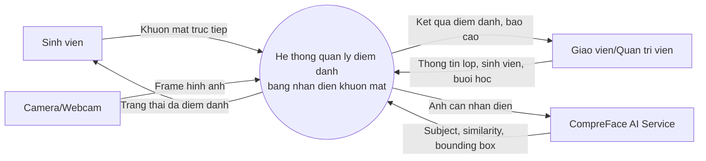
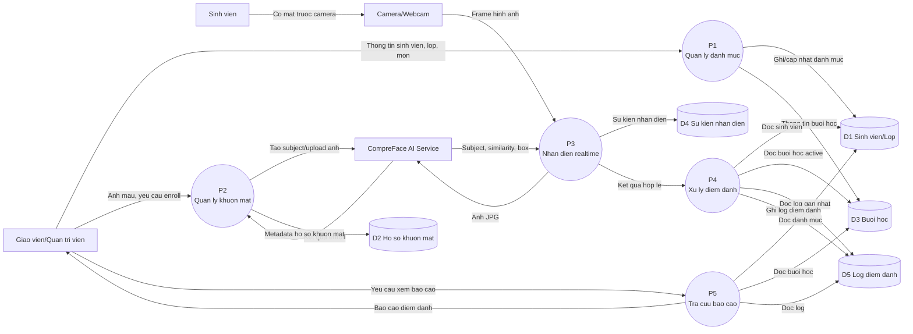
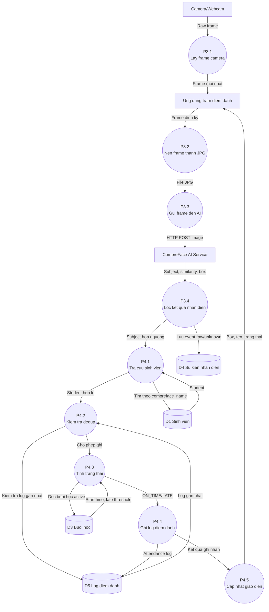
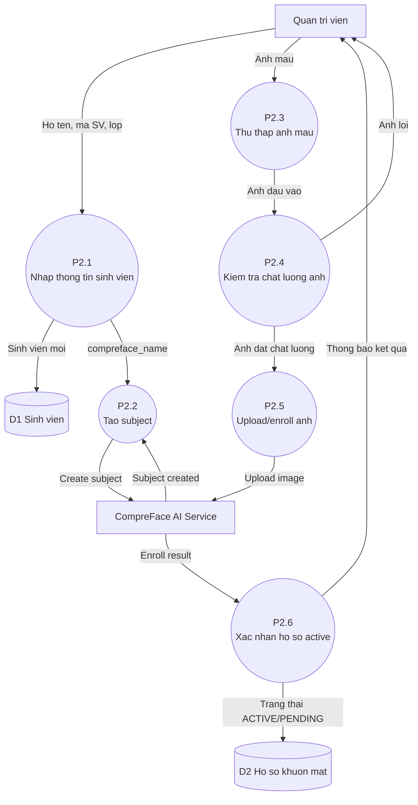

# Bieu do luong du lieu DFD

## 1. Quy uoc

| Ky hieu | Y nghia |
|---|---|
| Hinh tron/bo goc | Tien trinh xu ly |
| Hinh chu nhat | Tac nhan ngoai |
| Hinh tru/cylinder | Kho du lieu |
| Mui ten | Luong du lieu |

## 2. DFD muc ngu canh

## 3. DFD muc 0

## 4. DFD muc 1 cho tien trinh P3/P4: nhan dien va ghi diem danh

## 5. DFD muc 1 cho quan ly ho so khuon mat

## 6. Luong du lieu chinh

| Luong du lieu | Nguon | Dich | Noi dung |
|---|---|---|---|
| Frame hinh anh | Camera | Ung dung | Anh raw tu webcam |
| Goi nhan dien | Ung dung | CompreFace | Anh JPG + API key |
| Ket qua nhan dien | CompreFace | Ung dung | Subject, similarity, bounding box |
| Du lieu sinh vien | Quan tri vien | DB | Ho ten, lop, subject |
| Ban ghi diem danh | Service | DB | Student, session, time, status, similarity |
| Bao cao | DB | Giao vien | Danh sach co mat/muon/vang, thong ke |
