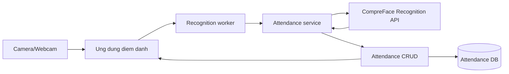

# Phan tich thiet ke he thong diem danh bang nhan dien khuon mat

Folder nay gom bo tai lieu phan tich lai he thong diem danh bang nhan dien khuon mat dua tren code hien co trong repo.

## Nguon hien trang

| Thanh phan | File/folder hien co | Vai tro |
|---|---|---|
| Giao dien chinh | `main_app.py` | PyQt5 app, hien thi camera va danh sach diem danh trong ngay |
| Client thu nghiem cu | `client_app.py` | Tkinter client goi CompreFace truc tiep |
| Xu ly nhan dien/diem danh | `attendance_service.py` | Goi CompreFace API, loc similarity, debounce, ghi log |
| Tang du lieu | `database/models.py`, `database/crud.py`, `database/db_config.py` | SQLAlchemy model, CRUD, ket noi DB |
| Schema DB | `database/schema.sql`, `database/schema_mysql.sql` | Mo ta bang `students`, `attendance_sessions`, `attendance_logs` |
| AI face recognition | `CompreFace_BachKhoa/` | Docker Compose cho CompreFace API/UI/Core/Postgres |

## Tai lieu trong folder

| File | Noi dung |
|---|---|
| `01_kien_truc_he_thong.md` | Kien truc tong the, pipeline train/enroll, pipeline diem danh, cau truc module de xuat |
| `02_mo_hinh_er.md` | Mo hinh ER, tu dien du lieu, quan he, rang buoc nghiep vu |
| `03_bieu_do_fdd.md` | Bieu do phan cap chuc nang FDD va ma tran chuc nang-du lieu |
| `04_bieu_do_dfd.md` | DFD muc ngu canh, muc 0 va muc 1 cho luong nhan dien-diem danh |
| `diagrams/*.mmd` | File Mermaid tach rieng de render hoac dua vao bao cao |
| `huong_doi_tuong/` | Bo tai lieu OOAD/UML: use case, class, sequence, activity, state va package/component |

## Bo sung phan tich huong doi tuong

Ben canh FDD, DFD va ERD theo huong cau truc, folder `huong_doi_tuong/` mo ta he thong theo huong doi tuong:

- **Use case diagram**: actor va muc tieu su dung he thong.
- **Class diagram**: entity, service, repository va integration class.
- **Sequence diagram**: thu tu tuong tac trong cac luong nghiep vu chinh.
- **Activity diagram**: quy trinh xu ly va cac nhanh dieu kien.
- **State diagram**: vong doi trang thai cua `User`, `AttendanceSession`, `FaceProfile`, `AttendanceLog`.
- **Package/component diagram**: cach chia module frontend, backend, database va CompreFace.

## Huong thiet ke lai

He thong nen tach thanh 5 lop:

1. **Presentation**: giao dien camera, bang diem danh, man hinh quan tri.
2. **Application service**: dieu phoi quy trinh nhan dien, ghi diem danh, bao cao.
3. **AI integration**: client goi CompreFace, quan ly subject va anh mau.
4. **Data access**: repository/CRUD cho sinh vien, buoi hoc, log diem danh.
5. **Database**: luu du lieu quan ly; CompreFace luu embedding/anh mau nhan dien.

Luon chinh:

Ghi chu: code hien tai khong train model local. Viec train/enroll khuon mat dang nam o CompreFace: tao subject, upload anh mau, CompreFace sinh embedding va tra ve `subject` + `similarity` khi nhan dien.
