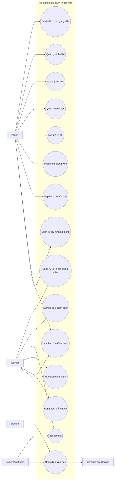

# Use case diagram

## 1. Mục đích

Use case diagram mô tả các actor bên ngoài hệ thống và những mục tiêu nghiệp vụ mà actor muốn đạt được khi tương tác với hệ thống.

## 2. Use case diagram

## 3. Bảng actor

| Actor | Mô tả | Quyền chính |
|---|---|---|
| Admin | Người quản trị dữ liệu nền | Duyệt giảng viên, tạo lớp/môn/sinh viên, phân công lớp tín chỉ |
| Teacher | Giảng viên sử dụng hệ thống để điểm danh | Tạo/mở session, bật camera, xác nhận điểm danh, xem lớp được phân công |
| Student | Sinh viên đi qua camera | Không thao tác trực tiếp, được nhận diện và ghi nhận điểm danh |
| Camera/Webcam | Thiết bị cung cấp frame ảnh | Cung cấp ảnh đầu vào cho nhận diện |
| CompreFace Service | Dịch vụ AI bên ngoài | Nhận ảnh, trả subject, similarity và box |

## 4. Bảng use case chính

| Use case | Actor chính | Kết quả |
|---|---|---|
| Đăng ký tài khoản giảng viên | Teacher | Tạo user `TEACHER` trạng thái `PENDING` |
| Duyệt tài khoản giảng viên | Admin | User chuyển `ACTIVE`, có thể đăng nhập |
| Quản lý sinh viên | Admin | Sinh viên được tạo/import và gán lớp |
| Tạo lớp tín chỉ | Admin | Lớp học được gắn với môn học/kỳ học |
| Phân công giảng viên | Admin | Giảng viên chỉ thấy lớp tín chỉ được phân công |
| Map hồ sơ khuôn mặt | Admin | `FaceProfile` liên kết student với CompreFace subject |
| Tạo/mở buổi điểm danh | Teacher | Session chuyển sang `OPEN` |
| Nhận diện sinh viên | Teacher, Camera, CompreFace | Tạo `RecognitionEvent`, trả kết quả cho UI |
| Xác nhận điểm danh | Teacher | Tạo/cập nhật `AttendanceLog` chính thức |
| Đóng buổi điểm danh | Teacher | Sinh viên chưa có log được đánh `ABSENT` |
| Xem báo cáo điểm danh | Teacher/Admin | Xem thống kê và danh sách điểm danh |

## 5. Mapping với code hiện tại

| Use case | Thành phần code liên quan |
|---|---|
| Đăng ký/dang nhập/đổi mật khẩu | `backend/app/api/v1/auth.py`, `AuthService` |
| Duyệt tài khoản | `backend/app/api/v1/users.py`, `UserService` |
| Phân công giảng viên | `TeacherAssignmentService`, `PermissionService` |
| Quản lý lớp/môn/sinh viên | `backend/app/routers/classes.py`, `courses.py`, `students.py` |
| Map hồ sơ khuôn mặt | `face_profiles.py`, `FaceProfile`, `CompreFaceClient` |
| Nhận diện camera | `recognition.py`, `RecognitionEvent`, `CompreFaceClient` |
| Điểm danh và báo cáo | `attendance_sessions.py`, `attendance_logs.py`, `reports.py` |

