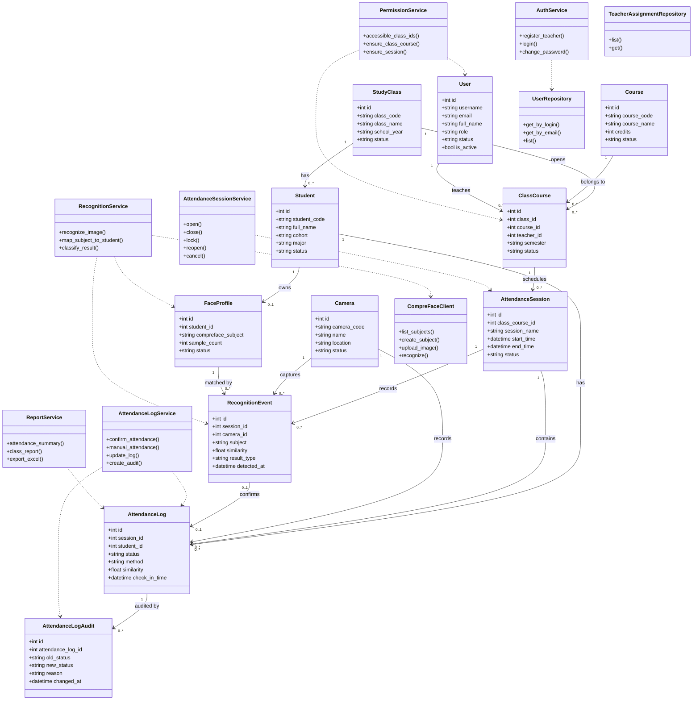

# Class diagram

## 1. Mục đích

Class diagram mô tả các lớp chính của hệ thống, thuộc tính quan trọng, phương thức nghiệp vụ tiêu biểu và quan hệ giữa các lớp. Khác với ERD, class diagram không chỉ mô tả bảng dữ liệu mà còn mô tả service, repository và integration.

## 2. Class diagram

## 3. Nhóm class

| Nhóm | Class | Trách nhiệm |
|---|---|---|
| Domain/entity | `User`, `Student`, `StudyClass`, `Course`, `ClassCourse` | Lưu thông tin người dùng, sinh viên, lớp, môn và lớp tín chỉ |
| Face recognition | `FaceProfile`, `RecognitionEvent`, `CompreFaceClient` | Quản lý subject CompreFace và sự kiện nhận diện |
| Attendance | `AttendanceSession`, `AttendanceLog`, `AttendanceLogAudit`, `Camera` | Quản lý buổi điểm danh, log chính thức, audit và camera |
| Service | `AuthService`, `PermissionService`, `AttendanceSessionService`, `AttendanceLogService`, `RecognitionService`, `ReportService` | Điều phối nghiệp vụ |
| Repository | `UserRepository`, `TeacherAssignmentRepository`, repository đề xuất | Đóng gói truy cập dữ liệu |

## 4. Mapping với code hiện tại

| Class trong thiết kế | Code hiện tại |
|---|---|
| Entity/domain class | `backend/app/models.py` |
| Auth/permission/user service | `backend/app/services/` |
| API controller/router | `backend/app/api/v1/`, `backend/app/routers/` |
| CompreFace integration | `backend/app/compreface_client.py` |
| Serializer/response mapping | `backend/app/serializers.py` |

## 5. Ghi chú thiết kế

Một số service như `RecognitionService`, `AttendanceSessionService`, `AttendanceLogService` có thể đang được triển khai một phần trong router hoặc service cũ. Trong báo cáo OOAD, vẫn nên mô hình hóa chúng thành service riêng để làm rõ trách nhiệm nghiệp vụ và hướng refactor lâu dài.

