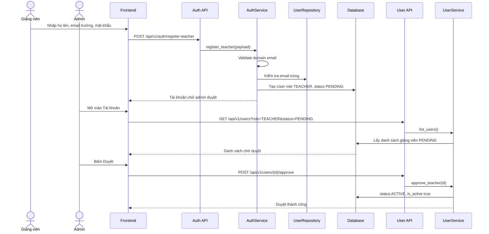
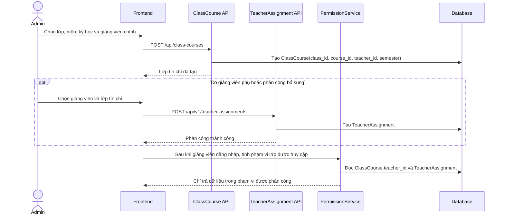
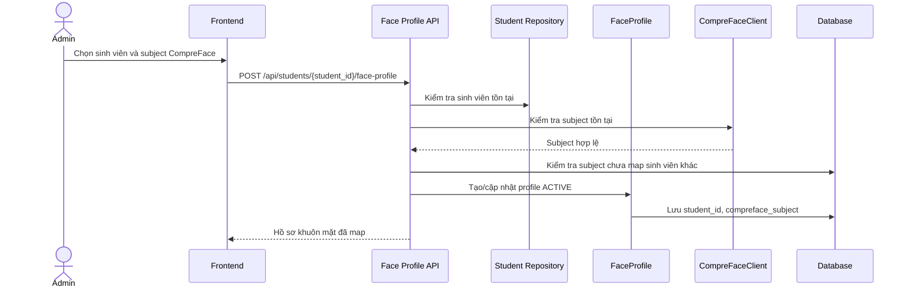
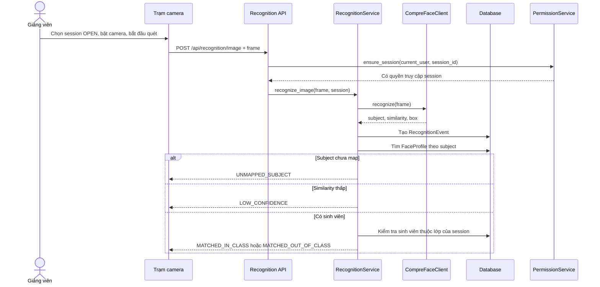
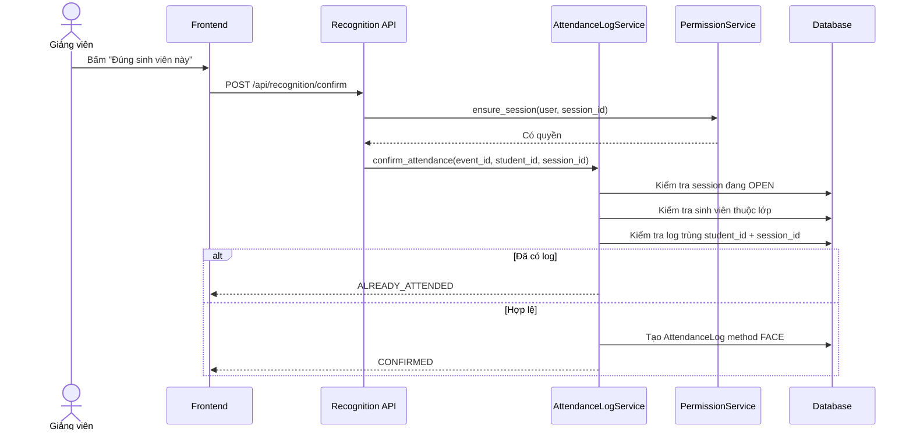
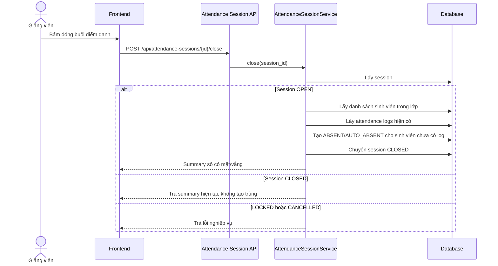

# Sequence diagrams

## 1. Mục đích

Sequence diagram mô tả thứ tự gửi thông điệp giữa các actor, UI, API, service, repository, database và CompreFace trong một luồng nghiệp vụ cụ thể.

## 2. Giảng viên đăng ký và admin duyệt

## 3. Admin tạo lớp tín chỉ và phân công giảng viên

## 4. Map sinh viên với subject CompreFace

## 5. Camera nhận diện sinh viên trong session đang mở

## 6. Giảng viên xác nhận điểm danh

## 7. Đóng session và tự tạo log vắng

## 8. Mapping với DFD

| DFD hiện có | Sequence diagram tương ứng |
|---|---|
| P2 Quản lý khuôn mặt | Map sinh viên với subject CompreFace |
| P3 Nhận diện realtime | Camera nhận diện sinh viên |
| P4 Xử lý điểm danh | Xác nhận điểm danh |
| P5 Tra cứu báo cáo | Có thể bổ sung sequence export báo cáo ở giai đoạn sau |
