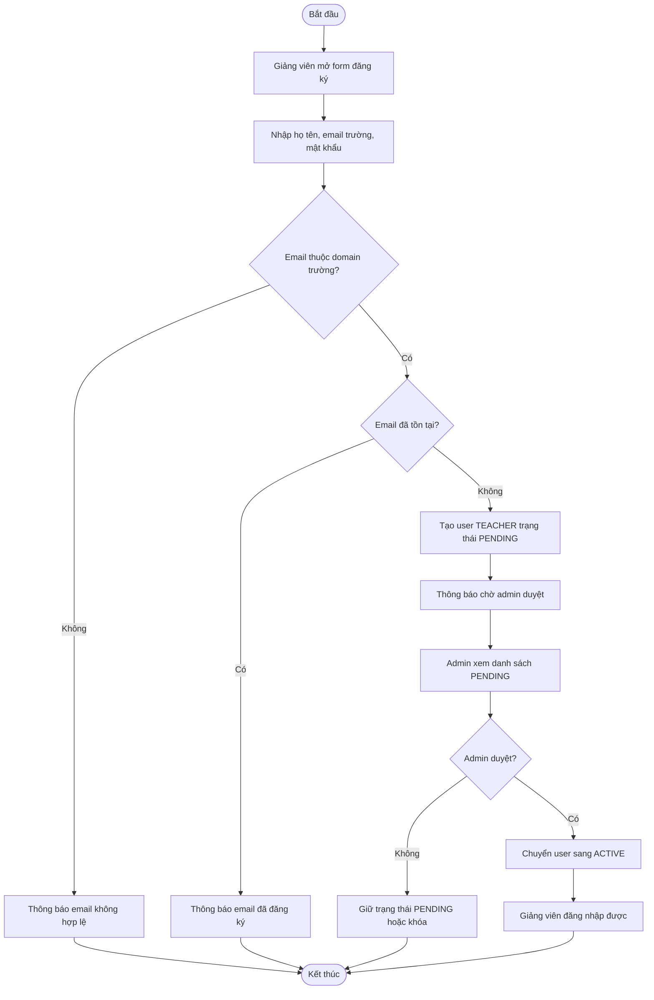
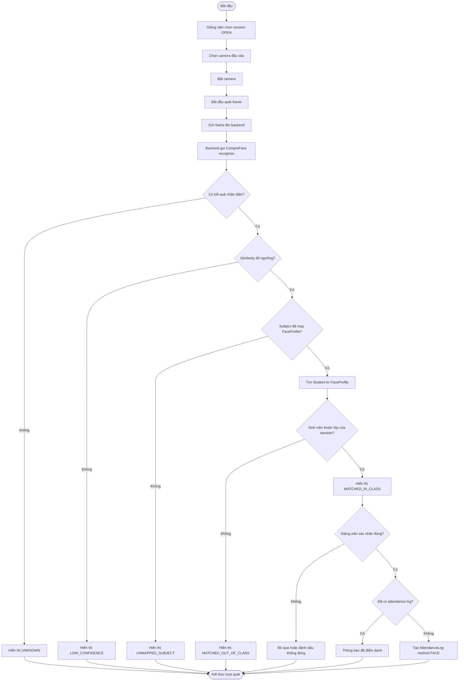
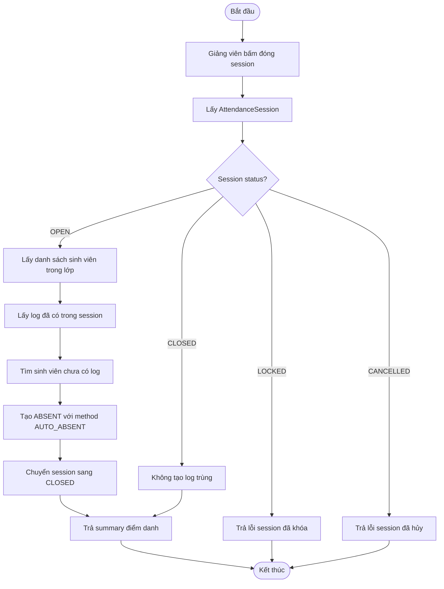

# Activity diagrams

## 1. Mục đích

Activity diagram mô tả quy trình nghiệp vụ, các bước xử lý, điều kiện rẽ nhánh và kết quả đầu ra.

## 2. Quy trình đăng ký và duyệt giảng viên

## 3. Quy trình điểm danh bằng camera

## 4. Quy trình đóng buổi điểm danh

## 5. Bảng trạng thái nhận diện

| Trạng thái | Ý nghĩa | Hành động frontend |
|---|---|---|
| `MATCHED_IN_CLASS` | Nhận diện ra sinh viên thuộc lớp của session | Cho phép giảng viên xác nhận điểm danh |
| `MATCHED_OUT_OF_CLASS` | Nhận diện ra sinh viên nhưng không thuộc lớp | Cảnh báo, không tự tạo log chính thức |
| `UNMAPPED_SUBJECT` | Subject CompreFace chưa map với sinh viên | Cảnh báo cần map hồ sơ khuôn mặt |
| `LOW_CONFIDENCE` | Similarity thấp | Cần kiểm tra lại |
| `UNKNOWN` | Không nhận diện được khuôn mặt hợp lệ | Không tạo log |

## 6. Mapping với code hiện tại

| Activity | Code liên quan |
|---|---|
| Đăng ký/duyệt giảng viên | `AuthService`, `UserService`, `auth.py`, `users.py` |
| Điểm danh camera | `recognition.py`, `CompreFaceClient`, `FaceProfile`, `RecognitionEvent` |
| Xác nhận điểm danh | `recognition/confirm`, `AttendanceLog` |
| Đóng session | `attendance_sessions.py`, `AttendanceSession`, `AttendanceLog` |

