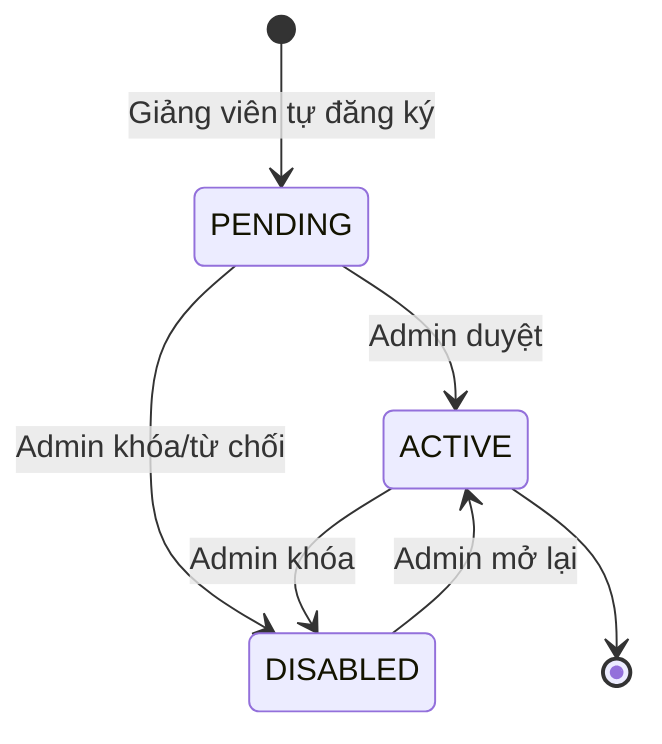
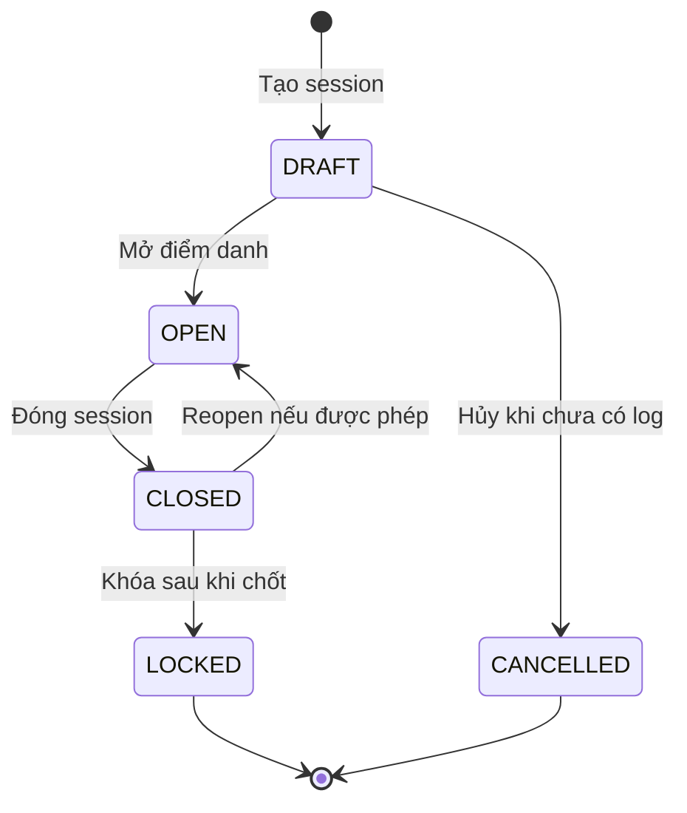
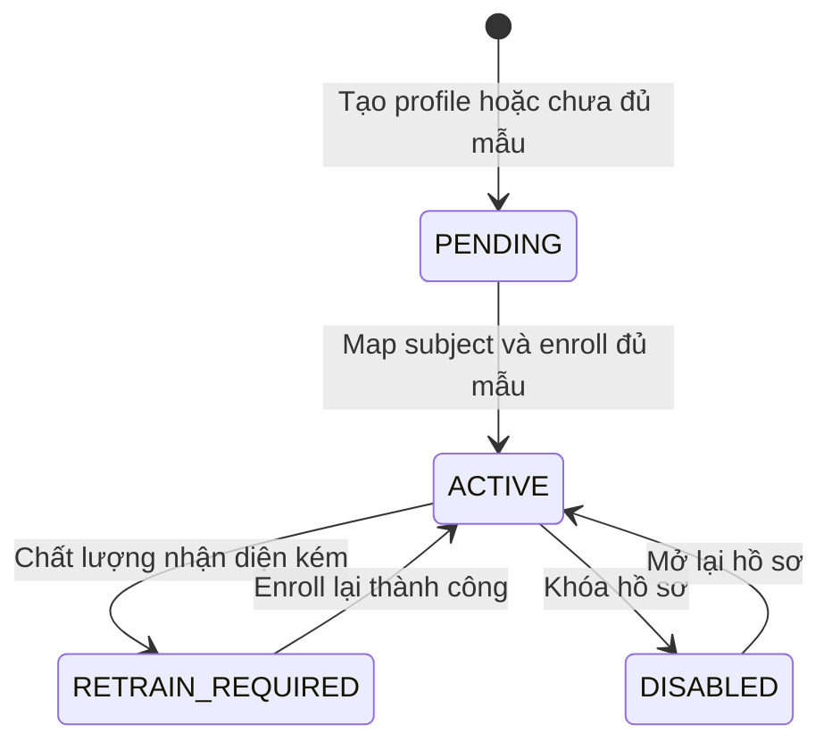
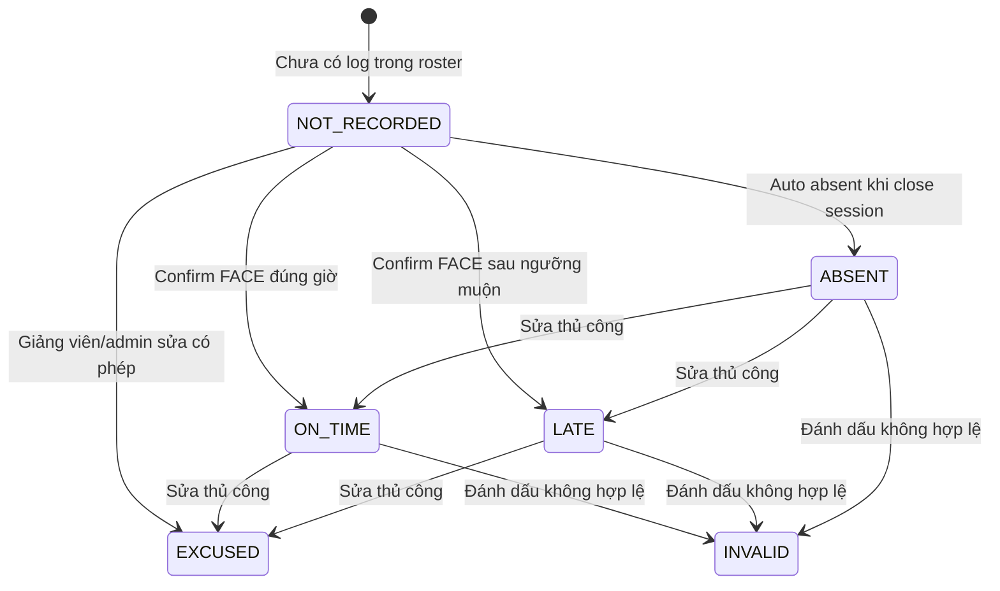

# State diagrams

## 1. Mục đích

State diagram mô tả vòng đời trạng thái của các đối tượng có thay đổi trạng thái rõ ràng trong quá trình sử dụng hệ thống.

## 2. User

| Trạng thái | Ý nghĩa |
|---|---|
| `PENDING` | Tài khoản giảng viên mới đăng ký, chưa được đăng nhập |
| `ACTIVE` | Tài khoản hợp lệ, có thể đăng nhập |
| `DISABLED` | Tài khoản bị khóa |

## 3. AttendanceSession

| Trạng thái | Ý nghĩa | Quy tắc |
|---|---|---|
| `DRAFT` | Buổi điểm danh mới tạo | Chưa nhận điểm danh |
| `OPEN` | Đang mở điểm danh | Chỉ trạng thái này được confirm attendance |
| `CLOSED` | Đã đóng | Có thể tạo `ABSENT` tự động cho sinh viên chưa có log |
| `LOCKED` | Đã khóa/chốt | Không cho sửa log |
| `CANCELLED` | Đã hủy | Không dùng để điểm danh |

## 4. FaceProfile

| Trạng thái | Ý nghĩa |
|---|---|
| `PENDING` | Hồ sơ chưa sẵn sàng nhận diện |
| `ACTIVE` | Subject đã map và có thể dùng để điểm danh |
| `RETRAIN_REQUIRED` | Cần thu thập/enroll lại ảnh |
| `DISABLED` | Hồ sơ bị khóa, không dùng để nhận diện chính thức |

## 5. AttendanceLog

| Trạng thái | Ý nghĩa |
|---|---|
| `NOT_RECORDED` | Chỉ dùng trong roster response, không lưu DB |
| `ON_TIME` | Sinh viên có mặt đúng giờ |
| `LATE` | Sinh viên có mặt muộn |
| `ABSENT` | Sinh viên vắng |
| `EXCUSED` | Vắng có phép hoặc được miễn |
| `PENDING_REVIEW` | Cần giảng viên kiểm tra |
| `INVALID` | Log bị đánh dấu không hợp lệ |

## 6. Ghi chú

Các state diagram này giúp kiểm tra rule nghiệp vụ:

- Không confirm điểm danh nếu session không `OPEN`.
- Không sửa log nếu session `LOCKED` hoặc `CANCELLED`.
- Không cho login nếu user `PENDING` hoặc `DISABLED`.
- Không dùng face profile `DISABLED` cho nhận diện chính thức.

