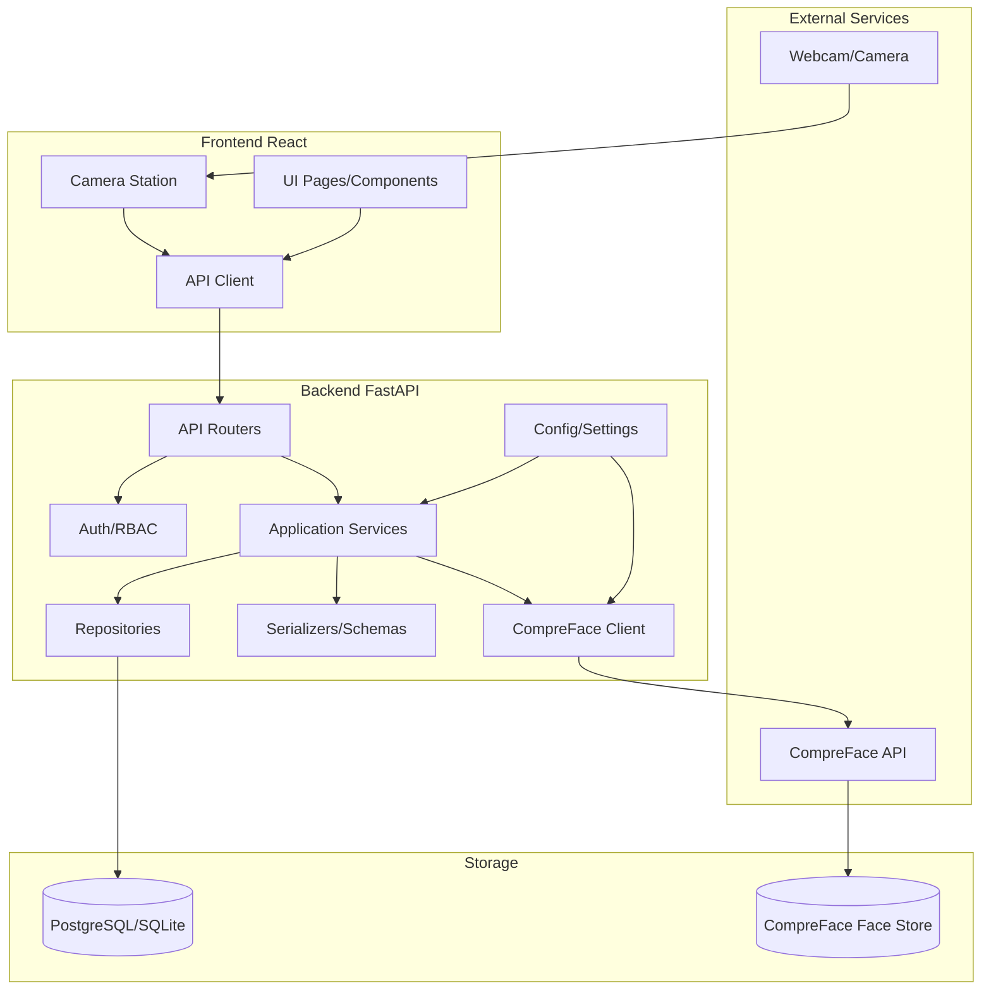

# Package/component diagram

## 1. Mục đích

Package/component diagram mô tả cách chia module triển khai và quan hệ phụ thuộc giữa frontend, backend, database và CompreFace.

## 2. Package/component diagram

## 3. Mô tả component

| Component | Vai trò | Code hiện tại |
|---|---|---|
| Frontend React | Giao diện cho admin/giảng viên, camera station | `frontend/src/App.jsx`, `frontend/src/App.css` |
| API Client | Gửi request từ frontend tới backend | Hàm `api()` trong frontend |
| API Routers | Nhận request, validate, gọi service | `backend/app/api/v1/`, `backend/app/routers/` |
| Auth/RBAC | JWT, role, quyền truy cập lớp/session | `backend/app/api/deps.py`, `PermissionService` |
| Application Services | Xử lý nghiệp vụ chính | `backend/app/services/`, `attendance_services.py` |
| Repositories | Truy cập dữ liệu | `backend/app/repositories/` |
| Database | Lưu dữ liệu quản lý điểm danh | SQLAlchemy models, PostgreSQL/SQLite |
| CompreFace Client | Gọi API nhận diện khuôn mặt | `backend/app/compreface_client.py` |
| CompreFace API | Dịch vụ AI nhận diện khuôn mặt | `CompreFace_BachKhoa/docker-compose.yml` |

## 4. Quy tắc phụ thuộc

| Quy tắc | Lý do |
|---|---|
| Frontend không gọi trực tiếp CompreFace | Không lộ API key và giữ logic mapping ở backend |
| Router không chứa nhiều nghiệp vụ phức tạp | Dễ test, dễ bảo trì |
| Service không hard-code database path/API key | Sẵn sàng deploy nhiều môi trường |
| Repository không gọi UI hoặc CompreFace | Giữ data access độc lập |
| Config/ENV là nơi chứa secret runtime | Không đưa key vào source code |

## 5. Mapping với kiến trúc 5 lớp

| Lớp kiến trúc | Component |
|---|---|
| Presentation | Frontend React, Camera Station |
| Application service | Auth, Permission, Recognition, Attendance, Report services |
| AI integration | CompreFace Client |
| Data access | Repository, SQLAlchemy session |
| Database/external storage | PostgreSQL/SQLite, CompreFace Face Store |

